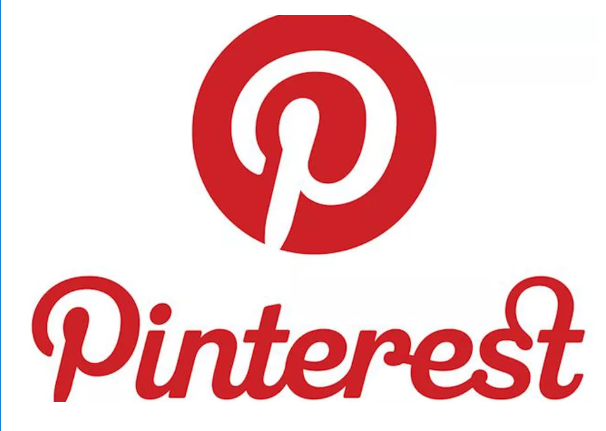
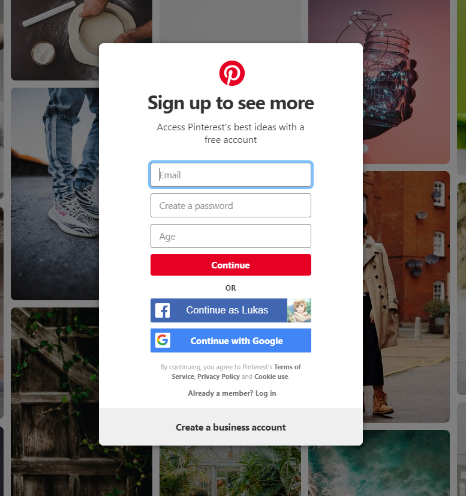
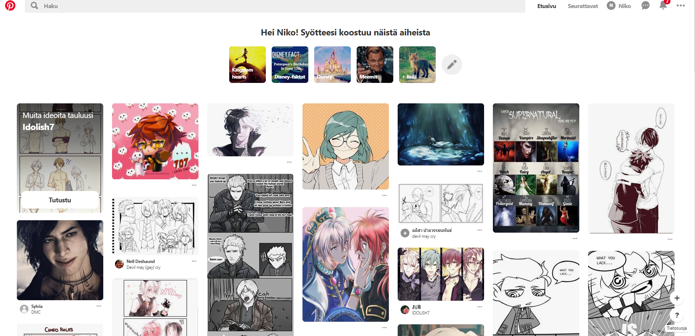

# Pinterest

## Mikä on Pinterest?

Pinterest sosiaalinen media linkkien ja kuvien jakopalvelu. Pinterestin idea on luoda "Tauluja" ja kokoeilmia, jotka liittyvät johonkin teemaan , harrastukseen tia tapahtumaan. Käyttäjät voivat myös halutessaan selata muiden luomia kokoelmia ja tallentaa sieltyä kuvia omiin kokoelmiinsa.

Kuina Pinterestiä Käytetään?
-------

1. Käyttäjän luominen

Pinterest vaatii toimiakseen tilin, joten ensimmäisenä täuytyy luoda käyttäjä. Sen on helppoa sillä voit kirjautua Google-tilin ja Facebookin avulla.

2. Käyttäminen

Eikun vain sitten selaamaan. Pinterestistä voit etsiä' inspitraatiota ja fanarttia tai vaikka ruokareseptejä.